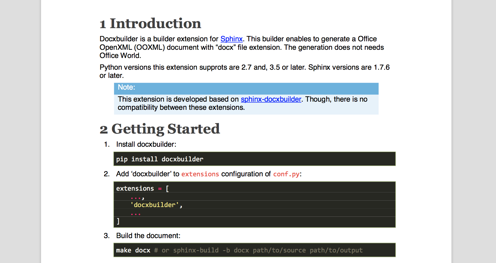

Introduction
============

sphinx-docx is a builder extension for `Sphinx`_. It generates an Office Open
XML (OOXML) document with a ``docx`` file extension. Office Word is not
required to build one.

:Python: 3.12 or later (developed and tested on 3.14)
:Sphinx: 9.0 or later

.. note::

   This is a fork of `docxbuilder`_, which itself descends from
   `sphinx-docxbuilder`_. The ``docx`` builder name and every ``docx_*``
   configuration value are unchanged, so only the ``extensions`` entry has to
   be updated when moving from ``docxbuilder``.

.. _`Sphinx`: https://www.sphinx-doc.org/en/master/
.. _`docxbuilder`: https://github.com/amedama41/docxbuilder
.. _`sphinx-docxbuilder`: https://github.com/haraisao/sphinx-docxbuilder

Getting Started
===============

#. Install sphinx-docx::

     pip install sphinx-docx

   For ``.. math::`` and the math role, which are rendered as OMML::

     pip install "sphinx-docx[math]"

#. Add ``sphinx_docx`` to ``extensions`` in ``conf.py``::

     extensions = [
         ...,
         'sphinx_docx',
         ...
     ]

#. Build the document::

     make docx  # or: sphinx-build -b docx path/to/source path/to/output

Usage
=====

sphinx-docx defines the configuration values below, which select the style
file and control the layout of the generated document.

**docx_documents**
  This value determines how to group the document tree into docx files.
  It must be a list of tuples ``(startdocname, targetname, docproperties, toctree_only)``,
  where the items are:

  *startdocname*
    A string, that is the document name of the docx file master document.
  *targetname*
    A string, that is the file name of the docx file.
  *docproperties*
    A dictionary from a string to a value, that specifies the document property.
    The detail is described on :doc:`docprops`.
  *toctree_only*
    If true, the contents of the *startdocname* document is not included in the
    output except the TOC tree.

**docx_style**
  The path to the style file.
  A relative path is taken as relative to the directory containing ``conf.py``.
  If set to the empty string, the default style file is used.
  Default: empty.
**docx_coverpage**
  If true, a cover page is inserted as the first page from the style file.
  If no cover page is found in the style file, no cover page is inserted.
  Default: ``True``.
**docx_pagebreak_before_section**
  The maximum section level, which a page break is inserted before sections with
  a level is less or equal to. Default: ``0`` (The level of top sections is 1,
  then no page break is inserted).
**docx_pagebreak_before_file**
  The maximum section level, which a page break is inserted before the first
  contents of each file in section level less than or equal to.
**docx_pagebreak_before_table_of_contents**
  The maximum section level, which a page break is inserted before each table of contents in section level less than or equal to.
  Default: ``-1`` (No page break is inserted).
**docx_pagebreak_after_table_of_contents**
  The maximum section level, which a page break is inserted after each table of
  contents in section level less than or equal to.
  Tables of contents are inserted in the place corresponding to non-hidden toctrees.
  Default: ``0`` (Page breaks are inserted after the tables before the first section).
**docx_update_fields**
  If true, Office Word asks to update fields in the generated document when it
  is opened. This is useful when the document references document properties.
  Default: ``False``.
**docx_bake_property_fields**
  If true, the cached result of each ``DOCPROPERTY`` field in the style file is
  replaced with the value the builder writes into the document properties.
  Office Word recalculates such fields itself, but everything else --
  LibreOffice in headless mode, ``pandoc``, PDF pipelines, text extraction --
  shows the cached result, which in most style files is a placeholder such as
  ``<n/a>``.
  Fields whose rendering depends on the reader (dates) or on Word's own
  conventions (booleans) keep their cached result.
  Default: ``True``.
**docx_nested_character_style**
  If true, a nested character style is written as direct run properties, so an
  inner style combines with the outer ones (``**bold**`` inside an emphasised
  span stays italic). If false, only the style reference is written and the
  innermost style replaces the outer ones, which keeps the runs tied to the
  style file at the cost of losing the combination.
  Default: ``True``.
**docx_table_options**
  A dictionary with table layout options.
  The following options are supported.
  Each can be overridden per table
  (see :ref:`class_based_customization_section`).

  *landscape_columns*
    The minimum number of table columns, which tables with the number of
    columns more than or equal to are allocated on landscape pages.
    If this number is ``0``, no tables are allocated on landscape pages.
    Default: ``0``.
  *in_single_page*
    If true, each table is arranged so as not to be divided into multiple pages as much as possible.
    Default: ``False``.
  *row_splittable*
    If false, a row **shall not** be arranged in multiple pages.
    Default: ``True``.
  *header_in_all_page*
    If true, table headers will be displayed on each page which the table is arranged in.
    If a table has no headers, this option is ignored.
    Default: ``False``.
**docx_style_names**
  A dictionary from a reStructuredText class name to a docx style name.
  The styles are applied to characters, paragraphs, or tables carrying the
  corresponding class name.
  The detail is described on :ref:`user_defined_styles_section`.
  Default: empty.

These configurations can be added to ``conf.py``::

  docx_documents = [
      ('index', 'sphinx_docx.docx', {
           'title': 'sphinx-docx documentation',
           'creator': 'author name',
           'subject': 'Sphinx builder extension',
           'keywords': ['sphinx'],
       }, True),
  ]
  docx_style = 'path/to/custom_style.docx'
  docx_pagebreak_before_section = 1

Images
======

SVG
---

Use ``.. image::`` or ``.. figure::`` with an ``.svg`` file, as with any other
image::

   .. image:: diagram.svg
      :width: 12cm

Each SVG is embedded twice: the vector original, which Word 2016 and later
draw sharp at any zoom, and a png rendered with ``cairosvg`` for older
clients.

Sizing follows the SVG's own ``width`` and ``height`` in any absolute unit
(``px``, ``pt``, ``pc``, ``in``, ``cm``, ``mm``), falling back to the
``viewBox`` when they are missing or relative. ``:width:`` and ``:height:``
override that as usual.

``cairosvg`` is a dependency. Without it the build still succeeds; every SVG
is skipped with a warning instead of aborting.

Images an SVG pulls in with an ``href`` (another svg, a bitmap) are inlined as
data URIs, so they survive the move into the docx. References made through CSS
``url()`` are not, and draw empty.

CSS custom properties are substituted before either renderer sees the file,
because neither ``cairosvg`` nor Word implements them. ``var(--bg, #ffffff)``
becomes ``#ffffff``; a ``var()`` with no fallback takes the value declared for
it elsewhere in the file, and one with neither becomes ``none``. draw.io emits
these constantly, and without the substitution ``cairosvg`` fails the whole
image with ``invalid literal for int() with base 16``.

Directives
==========

Beyond what `docxbuilder`_ handles:

.. list-table::
   :header-rows: 1
   :widths: auto

   * - Directive
     - Rendered as
   * - ``.. autosummary::``
     - the summary table, and with ``:toctree:`` the generated stub pages
   * - ``.. inheritance-diagram::``
     - a graphviz image, through the same path as ``.. graphviz::``
   * - ``.. productionlist::``
     - a borderless two-column table, styled ``Production List``
   * - ``.. acks::``
     - the contained bullet list
   * - ``.. py:class:: Widget[T]``
     - PEP 695 type parameters, in square brackets

Admonitions take one table style per type rather than a shared one:
``.. note::`` uses ``Admonition Note``, ``.. warning::`` uses
``Admonition Warning``, and ``.. admonition:: My Title`` uses
``Admonition My Title``. Define that style in the style file to change how
that one type looks; a type you do not define gets a style generated from
``Based Admonition``.

Code highlighting
=================

``:emphasize-lines:`` highlights a line with the ``highlight_color`` of the
Pygments style, which is normally a hex string. A common colour name is
accepted too:

.. code-block:: python

   # in conf.py, or a style module on sys.path
   from pygments.styles.default import DefaultStyle

   class MyStyle(DefaultStyle):
       highlight_color = 'lightgreen'

   pygments_style = 'mystyle.MyStyle'

Word does not take a colour here: its ``w:highlight`` accepts only the fifteen
names of the OOXML ``ST_HighlightColor`` list, and a file using any other name
is invalid. The requested colour is therefore snapped to the nearest name Word
does have, matching hue before brightness. ``lightgreen`` and ``lime``
highlight green, ``orange`` and ``gold`` yellow, ``navy`` dark blue.

Notes
=====

If the title of a ``rubric`` directive is "Footnotes", sphinx-docx ignores the
title, as the LaTeX writer does (see `sphinx documents`_).

.. _`sphinx documents`: https://www.sphinx-doc.org/en/master/usage/restructuredtext/directives.html#directive-rubric

TODO
====

* Support URL paths for images.
* Follow CSS ``url()`` references inside SVG images.
* Support image vertical alignment options.
